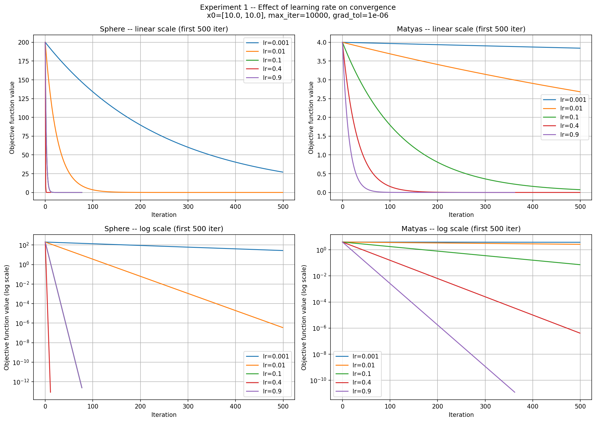
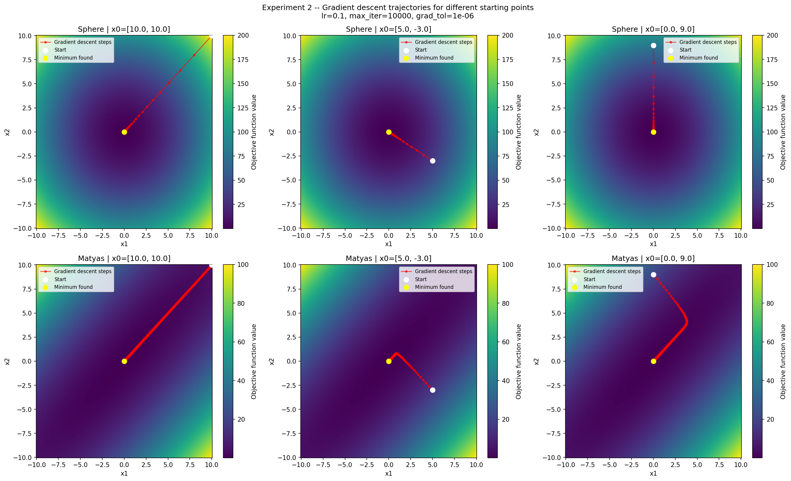

# Wprowadzenie do sztucznej inteligencji

**Numer ćwiczenia:** 1
**Temat:** Zagadnienie przeszukiwania i podstawowe podejścia do niego
**Typ dokumentu:** Raport z badań
**Semestr:** letni 2025/2026
**Autor:** Wiktor Sosnowski
**Numer albumu:** 348 561
**Data:** 14.06.2026

---

## Treść zadania

Cel zadania polega na implementacji algorytmu gradientu prostego oraz zbadaniu jego zachowania dla różnych wartości wymienionych niżej hiperparametrów. Metodę należy zastosować dla następujących funkcji:

- f(x) = x1^2 + x2^2
- funkcja Matyas (dla 2 wymiarów)

gdzie xi należy do przedziału [-10, 10], dla każdego i = 1, 2.

Kroki do wykonania:
1. Zaimplementuj algorytm gradientu prostego.
2. Zbadaj wpływ wartości parametru kroku na zbieżność metody - należy sporządzić wykres par (wartość funkcji celu, nr iteracji).
3. Dla ustalonej wartości parametru kroku zbadaj zachowanie algorytmu dla trzech wybranych punktów startowych. Wyniki przedstaw w postaci wizualnej.

---

## Interpretacja zadania

Algorytm gradientu prostego jest iteracyjną metodą optymalizacji, która w każdym kroku przesuwa bieżące rozwiązanie w kierunku przeciwnym do gradientu funkcji celu, zmierzając do minimum lokalnego.

Parametr kroku (ang. learning rate) określa, jak duży jest każdy krok. Zbyt mały krok spowalnia zbieżność, zbyt duży może powodować oscylacje lub rozbieżność. Punkt startowy wyznacza, skąd algorytm rozpoczyna poszukiwanie minimum.

Funkcja sferyczna (f(x) = x1^2 + x2^2) jest wypukłą paraboloidą o jednym globalnym minimum w (0, 0) - jest to funkcja referencyjna, prosta do analizy. Funkcja Matyas jest również wypukła i ma globalne minimum w (0, 0), ale jej kształt jest bardziej wydłużony (wąska "dolina" przebiegająca wzdłuż przekątnej), co utrudnia zbieżność gradientowi prostemu.

---

## Dane wejściowe

Obie badane funkcje są funkcjami dwuwymiarowymi (x1, x2), zdefiniowanymi analitycznie. Dziedzina obu funkcji to kwadrat [-10, 10] x [-10, 10].

---

## Opis implementacji

Implementacja składa się z czterech modułów:

**numerical_gradient.py** oblicza gradient numerycznie metodą różnicy centralnej: dla każdej współrzędnej xi wyznacza pochodną cząstkową ze wzoru (f(x+h) - f(x-h)) / (2h), gdzie h = 1e-5. Wybór różnicy centralnej (zamiast jednostronnej) uzasadnia dokładność rzędu O(h^2) przy tym samym koszcie obliczeniowym. Gradient obliczany numerycznie pozwala stosować algorytm do dowolnej funkcji bez konieczności ręcznego wyprowadzania pochodnych.

**functions.py** zawiera definicje obu badanych funkcji celu. Każda funkcja przyjmuje wektor numpy i zwraca skalar.

**gradient_descent.py** implementuje klasę GradientDescent realizującą algorytm gradientu prostego. Algorytm w każdej iteracji oblicza gradient w bieżącym punkcie i aktualizuje pozycję: x = x - lr * grad(x). Zastosowano dwa warunki stopu: osiągnięcie maksymalnej liczby iteracji (zabezpieczenie przed nieskończoną pętlą) oraz normę gradientu poniżej progu grad_tol = 1e-6 (kryterium zbieżności - wartość gradientu bliska zeru oznacza zbliżenie do minimum). Klasa zapisuje pełną historię wartości funkcji i odwiedzonych punktów, co umożliwia analizę przebiegu zbieżności.

**visualization.py** zawiera funkcje rysujące krzywe zbieżności oraz trajektorie na mapie kolorowej funkcji.

Wybór gradientu numerycznego zamiast modułu autograd upraszcza zależności i czyni implementację w pełni przejrzystą. Maksymalną liczbę iteracji ustalono na 10 000 - wartość wystarczająca dla obu badanych funkcji przy rozsądnych wartościach kroku. Próg zbieżności gradientu 1e-6 odpowiada praktycznej precyzji maszynowej dla liczb zmiennoprzecinkowych podwójnej precyzji. Zastosowano gradient descent wsadowy (batch) - w każdym kroku gradient obliczany jest dla całej dziedziny, co jest właściwe dla funkcji analitycznych bez danych treningowych.

---

## Eksperyment 1 - wpływ wartości kroku na zbieżność

Stałe parametry: x0 = [10,0; 10,0], max_iter = 10 000, grad_tol = 1e-6.

Badany parametr: learning_rate w zbiorze {0,001; 0,01; 0,1; 0,4; 0,9}.

### Funkcja sferyczna

| learning_rate | liczba iteracji | wartość f w minimum | zbieżność |
|---------------|-----------------|---------------------|-----------|
| 0,001         | 8 571           | 2,49e-13            | tak       |
| 0,01          | 850             | 2,43e-13            | tak       |
| 0,1           | 77              | 2,38e-13            | tak       |
| 0,4           | 11              | 8,39e-14            | tak       |
| 0,9           | 77              | 2,38e-13            | tak       |

Dla funkcji sferycznej wszystkie badane wartości kroku prowadzą do zbieżności. Wraz ze wzrostem kroku liczba iteracji maleje: od 8 571 dla lr = 0,001 do zaledwie 11 dla lr = 0,4. Krok lr = 0,9 wymaga takiej samej liczby iteracji jak lr = 0,1 (77), ponieważ dla funkcji Sphere współczynnik zbieżności wynosi |1 - 2·lr|, a wartości 0,1 i 0,9 dają identyczny wynik: |1 - 0,2| = |1 - 1,8| = 0,8 - różni je jedynie kierunek przekroczenia minimum, nie tempo zbieżności. Krok lr = 0,4 jest optymalny, gdyż minimalizuje ten współczynnik do 0,2, stąd zaledwie 11 iteracji. Wszystkie przebiegi osiągają wartość funkcji rzędu 1e-13, czyli praktycznie zero w arytmetyce zmiennoprzecinkowej.

Dla funkcji sferycznej optymalną wartością kroku jest lr = 0,4 - najszybsza zbieżność przy zachowaniu stabilności. Dla tej klasy funkcji (wypukłe, gładkie, symetryczne) większe kroki są bezpieczne.

### Funkcja Matyas

| learning_rate | liczba iteracji | wartość f w minimum | zbieżność |
|---------------|-----------------|---------------------|-----------|
| 0,001         | 10 000          | 1,80e+00            | nie       |
| 0,01          | 10 000          | 1,34e-03            | nie       |
| 0,1           | 3 305           | 1,25e-11            | tak       |
| 0,4           | 822             | 1,22e-11            | tak       |
| 0,9           | 362             | 1,19e-11            | tak       |

Dla funkcji Matyas zachowanie jest wyraźnie odmienne. Małe kroki (lr = 0,001 i lr = 0,01) nie osiągają zbieżności w limicie 10 000 iteracji - algorytm zatrzymuje się daleko od minimum (wartości funkcji 1,80 i 1,34e-03). Wynika to z wąskiej, ukośnej doliny funkcji Matyas: gradient wskazuje prostopadle do doliny zamiast wzdłuż niej, więc każdy krok jest mało efektywny. Większe kroki (lr >= 0,1) zbiegają, przy czym lr = 0,9 jest najszybszy (362 iteracje).

Dla funkcji Matyas wartości kroku poniżej 0,1 są niewystarczające - algorytm nie zbiega w rozsądnym limicie iteracji. Optymalnym wyborem w badanym zakresie jest lr = 0,9, który daje zbieżność w najmniejszej liczbie iteracji.

### Wykresy zbieżności

Na wykresach liniowych wyraźnie widać różnicę tempa zbieżności między małymi a dużymi krokami. Skala logarytmiczna ujawnia dodatkowy szczegół: przebiegi zbiegające mają prostoliniowy przebieg w skali log, co potwierdza wykładniczy charakter zbieżności metody gradientu prostego dla funkcji wypukłych. Dla Matyas z lr = 0,001 i lr = 0,01 pozioma linia na wykresie log wskazuje brak postępu - algorytm nie zbiegł w zadanym limicie iteracji.

**Wniosek z eksperymentu 1:** Wartość kroku ma krytyczny wpływ na zbieżność algorytmu. Dla prostych funkcji wypukłych (sferyczna) nawet duże kroki są bezpieczne. Dla funkcji o trudniejszej geometrii (Matyas) zbyt mały krok uniemożliwia zbieżność w praktycznym limicie iteracji. Nie istnieje jedna uniwersalna optymalna wartość kroku - zależy ona od kształtu funkcji celu.

---

## Eksperyment 2 - wpływ punktu startowego na trajektorię

Stałe parametry: learning_rate = 0,1, max_iter = 10 000, grad_tol = 1e-6.

Badany parametr: punkt startowy x0 w zbiorze {[10; 10], [5; -3], [0; 9]}.

### Funkcja sferyczna

| x0           | liczba iteracji | wartość f w minimum | x_opt             | zbieżność |
|--------------|-----------------|---------------------|-------------------|-----------|
| [10,0; 10,0] | 77              | 2,38e-13            | [0,000; 0,000]    | tak       |
| [5,0; -3,0]  | 73              | 2,41e-13            | [0,000; 0,000]    | tak       |
| [0,0; 9,0]   | 75              | 2,35e-13            | [0,000; 0,000]    | tak       |

### Funkcja Matyas

| x0           | liczba iteracji | wartość f w minimum | x_opt                   | zbieżność |
|--------------|-----------------|---------------------|-------------------------|-----------|
| [10,0; 10,0] | 3 305           | 1,25e-11            | [0,000018; 0,000018]    | tak       |
| [5,0; -3,0]  | 2 731           | 1,24e-11            | [0,000018; 0,000018]    | tak       |
| [0,0; 9,0]   | 3 106           | 1,25e-11            | [0,000018; 0,000018]    | tak       |

Dla funkcji sferycznej wszystkie trzy punkty startowe zbiegają do (0, 0) w zbliżonej liczbie iteracji (73-77). Nieznaczne różnice wynikają wyłącznie z różnej odległości punktu startowego od minimum. Wartości funkcji w minimum są praktycznie identyczne (rzędu 1e-13).

Dla funkcji Matyas liczba iteracji jest większa i bardziej zróżnicowana (2 731 - 3 305), co wynika z różnego położenia punktów startowych względem wąskiej doliny funkcji. Punkt startowy [5; -3] leży bliżej osi symetrii doliny i zbiega najszybciej. We wszystkich przypadkach algorytm odnajduje minimum globalne.

### Trajektorie

Dla funkcji sferycznej trajektorie są prostoliniowe - gradient zawsze wskazuje dokładnie w kierunku minimum, więc algorytm zmierza do niego po linii prostej niezależnie od punktu startowego.

Dla funkcji Matyas trajektorie są wyraźnie zakrzywione, szczególnie dla punktu startowego [5; -3] i [0; 9]. Algorytm początkowo porusza się prostopadle do wąskiej doliny funkcji, a dopiero po dotarciu do niej podąża wzdłuż niej ku minimum. To charakterystyczne zachowanie gradientu prostego na funkcjach o wydłużonym kształcie poziomicowym.

**Wniosek z eksperymentu 2:** Punkt startowy nie wpływa na zdolność algorytmu do znalezienia minimum globalnego dla badanych funkcji wypukłych - we wszystkich przypadkach algorytm zbiega do tego samego rozwiązania. Wpływa natomiast na liczbę wymaganych iteracji oraz kształt trajektorii. Dla funkcji o złożonej geometrii (Matyas) trajektoria może być silnie zakrzywiona, co wskazuje na nieefektywność gradientu prostego w takich przypadkach.

---

## Wnioski końcowe

| Parametr      | Wartość optymalna (Sphere) | Wartość optymalna (Matyas) |
|---------------|---------------------------|---------------------------|
| learning_rate | 0,4                       | 0,9                       |
| x0            | dowolny w [-10, 10]^2     | dowolny w [-10, 10]^2     |

Przeprowadzone eksperymenty pozwalają sformułować następujące wnioski:

1. Algorytm gradientu prostego skutecznie minimalizuje obie badane funkcje wypukłe, jednak jego efektywność silnie zależy od doboru parametru kroku.

2. Krok (learning rate) jest najważniejszym hiperparametrem algorytmu. Zbyt mały krok drastycznie spowalnia zbieżność lub uniemożliwia ją w praktycznym limicie iteracji (jak pokazał przypadek Matyas z lr <= 0,01). Zbyt duży krok może powodować oscylacje, jednak dla badanych funkcji wypukłych nie zaobserwowano rozbieżności nawet dla lr = 0,9.

3. Optymalna wartość kroku zależy od funkcji celu - nie istnieje jedna wartość dobra dla wszystkich przypadków. Dla funkcji sferycznej wystarczył lr = 0,4, dla Matyas najlepszy był lr = 0,9. Wynika to z różnej "trudności" geometrii obu funkcji.

4. Punkt startowy nie wpływa na wynik końcowy dla funkcji wypukłych - algorytm zawsze zbiega do minimum globalnego. Wpływa jedynie na liczbę iteracji i kształt trajektorii. Dla funkcji o bardziej złożonej geometrii (Matyas) trajektorie są zakrzywione i dłuższe, co jest konsekwencją niedopasowania kierunku gradientu do kierunku najszybszego zejścia do minimum.

5. Funkcja Matyas okazała się znacznie trudniejsza dla algorytmu niż sferyczna - wymaga więcej iteracji i jest wrażliwsza na zbyt mały krok. Wynika to z jej wydłużonego, ukośnego kształtu, który powoduje, że gradient wskazuje kierunek niemal prostopadły do optymalnej ścieżki zejścia.
