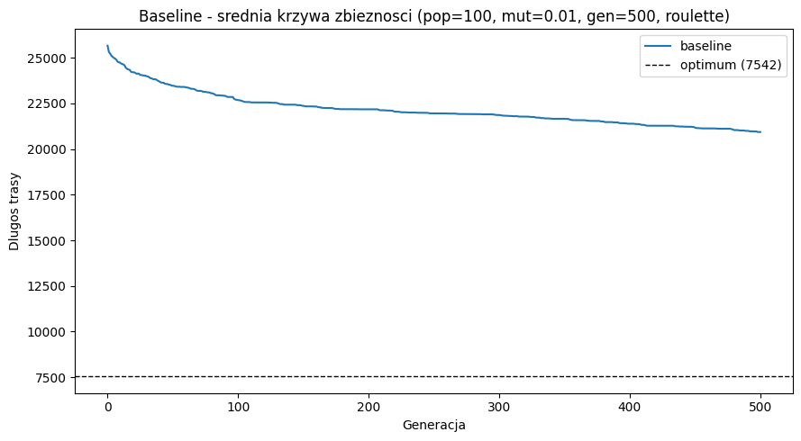
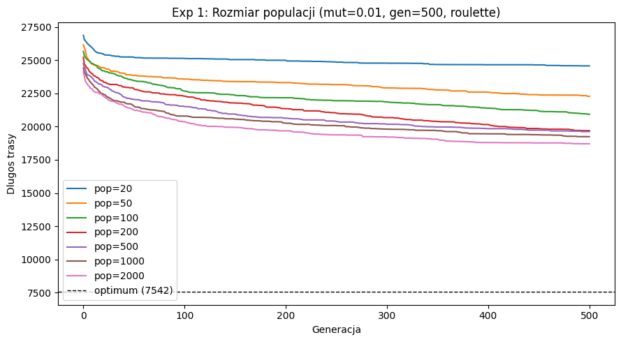
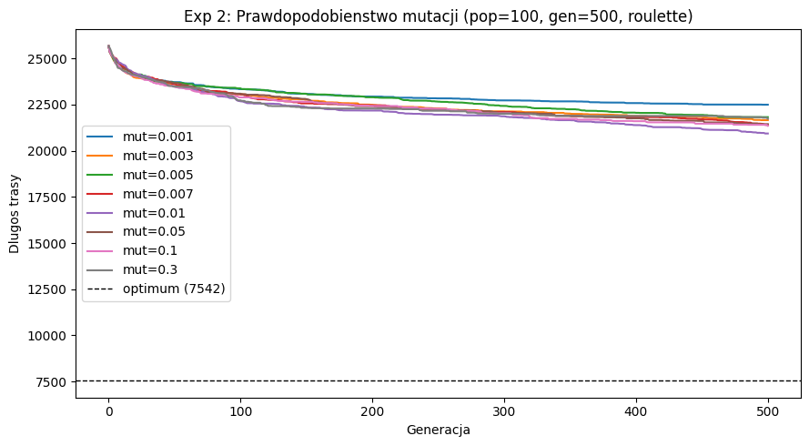
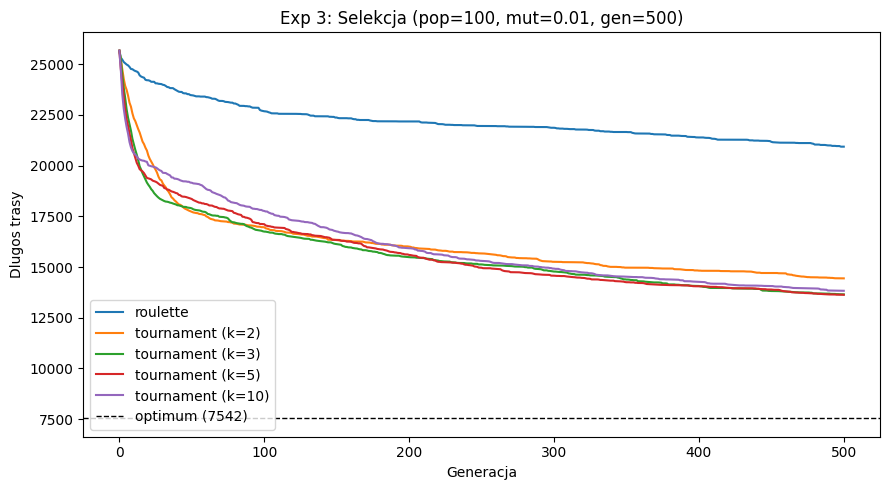

# Wprowadzenie do sztucznej inteligencji

**Ćwiczenie 02 - Algorytmy genetyczne i ewolucyjne**

**Typ dokumentu:** Raport z badań
**Semestr:** letni, rok akademicki 2025/2026
**Autor:** Wiktor Sosnowski
**Numer albumu:** 348 561
**Miejsce i data:** Warszawa, czerwiec 2026 r.

---

## 1. Treść zadania

Celem zadania jest implementacja algorytmu genetycznego wykorzystującego mutację, selekcję ruletkową, krzyżowanie jednopunktowe oraz sukcesję generacyjną. Zaimplementowany algorytm ma następnie posłużyć do optymalizacji klasycznego, symetrycznego problemu komiwojażera (ang. *Traveling Salesperson Problem* – TSP).

Kroki do wykonania:

1. Implementacja algorytmu genetycznego.
2. Zastosowanie algorytmu do rozwiązania problemu komiwojażera. Eksperymentalny dobór zestawu parametrów pozwalających na uzyskanie zadowalających wyników.
3. Zbadanie wpływu następujących modyfikacji na rezultaty osiągane przez algorytm:
   - zwiększenie prawdopodobieństwa mutacji,
   - zmiana metody selekcji na turniejową.

---

## 2. Interpretacja zadania

Problem komiwojażera (TSP) polega na znalezieniu najkrótszej możliwej trasy odwiedzającej każde miasto z zadanego zbioru dokładnie jeden raz i kończącej się w punkcie startowym. Jest to klasyczne zagadnienie optymalizacji kombinatorycznej, należące do klasy problemów NP-trudnych.

Algorytm genetyczny stanowi heurystykę przeszukiwania przestrzeni rozwiązań, naśladującą mechanizmy ewolucji biologicznej. Populacja osobników (w tym przypadku: permutacji miast) podlega procesom selekcji, krzyżowania i mutacji na przestrzeni kolejnych generacji. Funkcja przystosowania (ang. *fitness function*) jest definiowana jako odwrotność długości trasy – im krótsza trasa, tym wyższa wartość funkcji przystosowania osobnika.

Selekcja ruletkowa przydziela każdemu osobnikowi prawdopodobieństwo wyboru wprost proporcjonalne do jego wartości funkcji przystosowania. Selekcja turniejowa polega na wylosowaniu grupy $k$ osobników i wybraniu spośród nich najlepszego rozwiązania – parametr $k$ (rozmiar turnieju) pozwala na kontrolowanie siły presji selekcyjnej.

Krzyżowanie jednopunktowe w kontekście permutacji realizowane jest następująco: część trasy pierwszego rodzica (aż do losowo wybranego punktu przecięcia) jest bezpośrednio kopiowana do potomka, natomiast pozostałe pozycje uzupełniane są miastami w kolejności ich występowania u drugiego rodzica, z pominięciem tych, które zostały już dodane. Taki mechanizm gwarantuje poprawność nowo powstałej permutacji (brak duplikatów i brakujących miast).

Mutacja typu *swap*: z zadanym prawdopodobieństwem zamieniane są pozycje dwóch losowo wybranych miast wewnątrz wygenerowanej trasy.

Sukcesja generacyjna zakłada, że w każdej kolejnej iteracji algorytmu cała dotychczasowa populacja jest w 100% zastępowana nowo wygenerowanym pokoleniem potomków.

---

## 3. Zbiór danych

W badaniach wykorzystano instancję `berlin52` z referencyjnej biblioteki TSPLIB. Instancja ta zawiera 52 miasta, których położenie określone jest za pomocą współrzędnych euklidesowych. Zgodnie ze standardem TSPLIB, odległości pomiędzy węzłami obliczano jako odległości euklidesowe zaokrąglone do najbliższej liczby całkowitej. Znane optymalne rozwiązanie dla tej instancji wynosi 7542.

---

## 4. Szczegóły implementacji

Implementacja opiera się na dwóch głównych modułach:

* `tsp_utils.py` – odpowiada za wczytywanie plików formatu TSPLIB, budowanie macierzy odległości oraz wyliczanie całkowitej długości trasy i wartości funkcji przystosowania.
* `genetic_algorithm.py` – zawiera klasę `GeneticAlgorithm`, która przyjmuje jako parametry wejściowe: macierz odległości, rozmiar populacji, prawdopodobieństwo mutacji, liczbę generacji, wybraną metodę selekcji oraz rozmiar turnieju. Moduł realizuje inicjalizację populacji losowymi permutacjami, selekcję (ruletkową oraz turniejową), krzyżowanie jednopunktowe (z mechanizmem naprawy permutacji), mutację *swap* oraz sukcesję generacyjną.

Każdy z wariantów parametrycznych uruchamiano 25 razy przy użyciu różnych ziaren generatora liczb pseudolosowych (ang. *seed* od 0 do 24). Zgromadzone wyniki zapisano do plików `results.json` oraz `raw_lengths.csv` w celu dalszej analizy.

---

## 5. Konfiguracja bazowa (Baseline)

* **Parametry:** `pop_size = 100`, `mutation_prob = 0,01`, `n_generations = 500`, `selection = roulette`.

| Wariant  | min       | średnia   | std     | max       |
|----------|-----------|-----------|---------|-----------|
| baseline | 17876,00  | 20937,24  | 1048,06 | 22481,00  |

Uzyskane wartości są znacznie wyższe od globalnego optimum wynoszącego 7542. Jest to zachowanie jak najbardziej oczekiwane dla algorytmu pozbawionego mechanizmu elityzmu i operującego na mocno ograniczonej liczbie generacji. Powyższe wyniki stanowią punkt odniesienia (bazę) dla kolejnych eksperymentów.

---

## 6. Eksperyment 1 - Wpływ rozmiaru populacji

* **Stałe parametry:** `mutation_prob = 0,01`, `n_generations = 500`, `selection = roulette`.
* **Badany zakres:** `pop_size` $\in \{20, 50, 100, 200, 500, 1000, 2000\}$.

| Wariant          | min       | średnia   | std     | max       |
|------------------|-----------|-----------|---------|-----------|
| pop_size = 20    | 22158,00  | 24580,00  | 956,84  | 26262,00  |
| pop_size = 50    | 19776,00  | 22290,64  | 1080,27 | 25053,00  |
| pop_size = 100   | 17876,00  | 20937,24  | 1048,06 | 22481,00  |
| pop_size = 200   | 17963,00  | 19702,44  | 1001,07 | 21496,00  |
| pop_size = 500   | 16920,00  | 19629,24  | 920,07  | 21084,00  |
| pop_size = 1000  | 17693,00  | 19247,20  | 781,75  | 20612,00  |
| pop_size = 2000  | 15097,00  | 18710,24  | 1080,44 | 20118,00  |

Średnia długość trasy maleje wraz ze wzrostem wielkości populacji – od 24580,00 dla `pop_size = 20` do 18710,24 w przypadku `pop_size = 2000`. Najbardziej wyrazistą poprawę można zaobserwować w przedziale od 20 do 200 osobników. Powyżej populacji liczącej 500 osobników tempo poprawy wyraźnie spowalnia (różnica średnich między populacją 500 a 1000 wynosi 382, natomiast między 1000 a 2000 zaledwie 537). Najniższe odchylenie standardowe odnotowano dla wielkości 1000 osobników (781,75). Zwiększenie populacji do 2000 skutkuje ponownym wzrostem odchylenia do poziomu 1080,44 (porównywalnego z najmniejszymi populacjami), co dowodzi, że tak rozbudowana pula osobników wymaga znacznie większej liczby generacji do osiągnięcia pełnej zbieżności.

**Wnioski:** Zwiększenie rozmiaru populacji pozytywnie wpływa na średnią jakość generowanych rozwiązań, jednak marginalny zysk z tego tytułu maleje dla dużych wartości tego parametru. Zauważalny skok wariancji wyników dla `pop_size = 2000` sugeruje deficyt w limitach ewaluacyjnych – przy sztywnym ograniczeniu do 500 generacji, algorytm nie zdążył w pełni wyeksploatować potencjału poszukiwań. Nie dyskwalifikuje to skuteczności dużych populacji; wymaga jedynie adekwatnego zwiększenia limitu czasowego działania algorytmu (liczby epok).

---

## 7. Eksperyment 2 - Wpływ prawdopodobieństwa mutacji

* **Stałe parametry:** `pop_size = 100`, `n_generations = 500`, `selection = roulette`.
* **Badany zakres:** `mutation_prob` $\in \{0{,}001, 0{,}003, 0{,}005, 0{,}007, 0{,}01, 0{,}05, 0{,}1, 0{,}3\}$.

| Wariant                   | min       | średnia   | std     | max       |
|---------------------------|-----------|-----------|---------|-----------|
| mutation_prob = 0,001     | 20871,00  | 22498,12  | 961,11  | 24610,00  |
| mutation_prob = 0,003     | 19303,00  | 21660,84  | 1385,32 | 24203,00  |
| mutation_prob = 0,005     | 18653,00  | 21823,20  | 1244,03 | 23962,00  |
| mutation_prob = 0,007     | 18986,00  | 21403,84  | 1278,96 | 23646,00  |
| mutation_prob = 0,01      | 17876,00  | 20937,24  | 1048,06 | 22481,00  |
| mutation_prob = 0,05      | 20111,00  | 21446,00  | 799,25  | 23299,00  |
| mutation_prob = 0,1       | 19843,00  | 21354,32  | 821,29  | 22897,00  |
| mutation_prob = 0,3       | 19387,00  | 21738,32  | 750,77  | 23199,00  |

Najlepszą średnią długość trasy (20937,24) osiągnięto dla współczynnika mutacji ustalonego na poziomie 0,01. Niższe wartości generują słabsze rezultaty – dla `mutation_prob = 0,001` odnotowano średnią 22498,12, co jest typowym objawem zbyt słabej eksploracji przestrzeni rozwiązań i wczesnego utknięcia w minimach lokalnych. Przekroczenie optymalnego progu 0,01 prowadzi z kolei do ponownego pogorszenia wyników (wzrost średnich do pułapu 21354–21823), jako że nadmierna mutacja zaczyna pełnić rolę destrukcyjną, niszcząc korzystne sekwencje wypracowane w drodze krzyżowania. Zależność badanej cechy nie wykazuje cech monotoniczności. Wraz ze wzrostem prawdopodobieństwa ulega natomiast redukcji odchylenie standardowe (z poziomu 961 do 751), co gwarantuje wyższą stabilność i powtarzalność kosztem obniżenia ogólnej jakości wyniku.

**Wnioski:** Rozpatrując zbiór testowy `berlin52` w zestawieniu z podaną bazą konfiguracji, jako najbardziej optymalne wskazuje się prawdopodobieństwo mutacji o wartości rzędu 0,01. Nadmierne ograniczenie dynamiki mutacji skutkuje obniżoną zdolnością eksploracyjną populacji, podczas gdy jej sztuczne zawyżanie hamuje poprawne dziedziczenie pozytywnych cech. Optimum to posiada charakter relatywny – jego właściwy punkt ciężkości ulegnie transformacji w przypadku modyfikacji pozostałych wskaźników eksperymentu.

---

## 8. Eksperyment 3 - Wpływ metody selekcji

* **Stałe parametry:** `pop_size = 100`, `mutation_prob = 0,01`, `n_generations = 500`.
* **Badane warianty:** selekcja ruletkowa oraz selekcja turniejowa z rozmiarem turnieju $k \in \{2, 3, 5, 10\}$.

| Wariant              | min       | średnia   | std    | max       |
|----------------------|-----------|-----------|--------|-----------|
| roulette             | 17876,00  | 20937,24  | 1048,06| 22481,00  |
| turniej (k = 2)      | 13034,00  | 14443,84  | 949,16 | 16322,00  |
| turniej (k = 3)      | 12028,00  | 13655,16  | 860,98 | 15168,00  |
| turniej (k = 5)      | 11781,00  | 13632,20  | 792,04 | 15078,00  |
| turniej (k = 10)     | 12447,00  | 13831,16  | 704,40 | 15659,00  |

Zastosowanie selekcji turniejowej owocuje bezwzględną dominacją nad wariantem ruletkowym w każdej przeprowadzonej próbie. Uśredniony rezultat przy wariancie ruletkowym zatrzymał się na wysokości 20937,24, podczas gdy najskuteczniejsza seria turniejowa (dla $k = 5$) wypracowała próg 13632,20 – co przekłada się na gigantyczną poprawę o blisko 35%. Globalne minimum (11781) również wywodzi się z puli wyników dla współczynnika $k = 5$. Różnice pomiarowe między czołowymi wymiarami turniejowymi ($k = 3$ i $k = 5$) pozostają znikome. Poszerzenie puli turniejowej do $k = 10$ przynosi z kolei widoczny regres jakości (średnia wzrasta do 13831,16), ewidentnie w następstwie skrajnie silnej presji na eliminację jednostek słabszych, drastycznie wyjaławiającej zróżnicowanie genetyczne grupy. Należy zauważyć stały trend spadkowy dla poziomu odchylenia standardowego w miarę zwiększania presji parametru $k$.

**Wnioski:** Konfrontacja obu modeli selekcyjnych na rzecz analizy problemu komiwojażera w sposób bezapelacyjny promuje podejście turniejowe. Najbardziej wyważone korzyści w zakresie rozmiaru turnieju sytuują się w granicach $k = 3$ do $5$. Limitowana formuła uczestników ($k = 2$) wywiera relatywnie słaby docisk ewolucyjny, podczas gdy rygorystyczne rozszerzenie grona ($k = 10$) prowokuje niepożądane zjawisko przedwczesnej konwergencji.

---

## 9. Podsumowanie i wnioski końcowe

Optymalna konfiguracja parametrów dla limitu 500 generacji, zidentyfikowana w toku eksperymentów, przedstawia się następująco:

| Parametr        | Najlepsza badana wartość | Średnia długości trasy |
|-----------------|--------------------------|------------------------|
| pop_size        | 2000                     | 18710,24               |
| mutation_prob   | 0,01                     | 20937,24               |
| metoda selekcji | turniej ($k = 5$)        | 13632,20               |

Kluczowym czynnikiem stymulującym rozwój poszukiwanego optimum, który zaoferował najbardziej znaczącą poprawę (ok. 35%), okazała się modyfikacja strategii selekcyjnej z koła ruletki w stronę selekcji turniejowej z parametrem $k = 5$. Zmiany rozmiarów populacji niewątpliwie dyktują własne tendencje sprawnościowe układu, z zastrzeżeniem, że wykładnicza rozbudowa bazy osobników traci moc przełożenia bez adekwatnie przydzielonego budżetu na wyższe rezerwy iteracyjne (generacje). Natężenie prawdopodobieństwa mutacji dysponuje z kolei statusem czynnika o działaniu wysoce zachowawczym (umiarkowanym), z optymalnym wypośrodkowaniem skupionym blisko wartości `0,01`.

Udokumentowany zestaw wyników nie dorównuje parametrom docelowym (optymalnemu rozwiązaniu) przewidzianym dla standardu `berlin52` (7542). Stanowi to bezpośrednią konsekwencję restrykcyjnych uwarunkowań narzuconych środowisku testowemu – przede wszystkim limitowanego zasięgu operacyjnego generacji, a w głównej mierze braku strategii elitaryzmu w cyklach zastępowania starych populacji potomstwem.