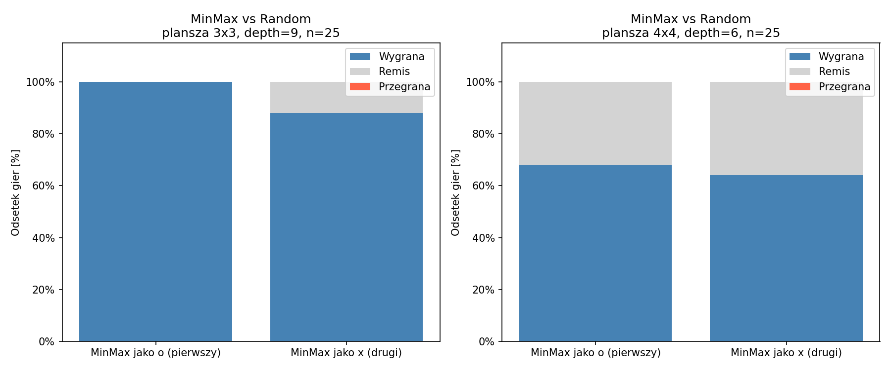
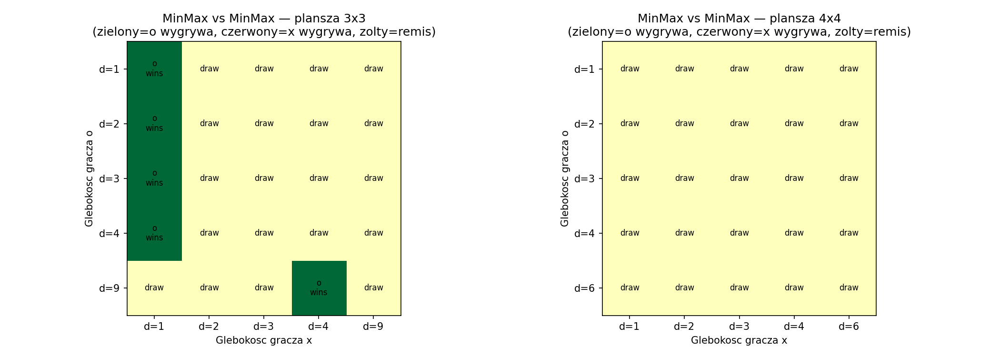
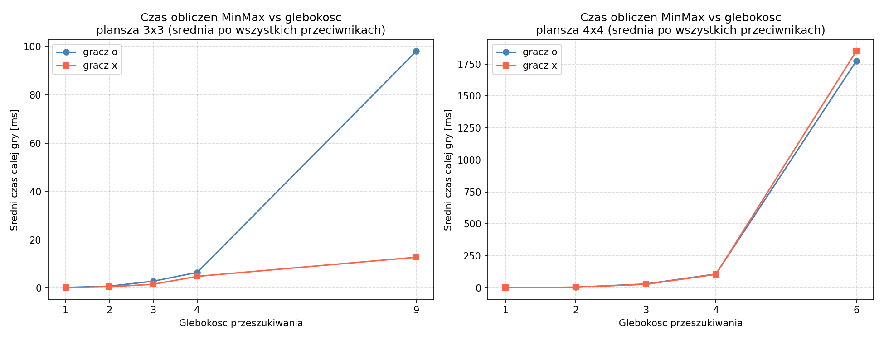

# Wprowadzenie do sztucznej inteligencji

**Ćwiczenie 3 - Dwuosobowe gry deterministyczne**

Raport z badań

---

Semestr letni 2025/2026

Autor: Wiktor Sosnowski

Numer albumu: 348 561

Data: 15.06.2026

---

## Treść zadania

Cel zadania polega na implementacji algorytmu min-max z przycinaniem alfa-beta i zastosowaniu go do gry w kółko i krzyżyk (tic-tac-toe). Do rozwiązania zadania można wykorzystać gotową implementację gry w kółko i krzyżyk, dostępną pod adresem: [moja strona domowa]/WSI/ttt.zip. Gra ta posiada prosty interfejs tekstowy, zaimplementowanego gracza "ludzkiego" i losowego, jak również "zaślepkę" dla gracza wykorzystującego algorytm min-max.

Kroki do wykonania:

1. Uruchomienie gry dla gracza losowego i ludzkiego (w celu zapoznania się ze sposobem działania gry).
2. Implementacja algorytmu min-max z przycinaniem alfa-beta. Ocena gracza min-max (porównanie jego zachowania w starciu z graczem ludzkim w stosunku do gracza losowego).
3. Rozszerzenie gry o możliwość konfiguracji różnych poziomów głębokości drzewa przeszukiwań dla dwóch graczy min-max. Uruchomienie gry dla dwóch graczy min-max o różnej głębokości drzewa przeszukiwań (dla kilku wartości tego parametru) i skomentowanie wpływu głębokości przeszukiwania drzewa gry na jakość wyników uzyskiwanych przez graczy.

Punkty 2 i 3 należy wykonać dla standardowego rozmiaru planszy (3x3), jak również dla jednego wybranego większego rozmiaru.

---

## Interpretacja zadania

Celem zadania jest implementacja algorytmu min-max z przycinaniem alfa-beta jako gracza w grze w kółko i krzyżyk. Algorytm min-max przeszukuje drzewo możliwych stanów gry: gracz maksymalizujący (MAX) wybiera ruch dający najwyższą ocenę, gracz minimalizujący (MIN) - najniższą. Przycinanie alfa-beta eliminuje gałęzie drzewa, które nie mogą wpłynąć na wynik - dzięki temu liczba sprawdzanych stanów jest istotnie mniejsza niż przy pełnym przeszukaniu.

Przy ograniczonej głębokości przeszukiwania stany nieterminalne ocenia funkcja heurystyczna. Zastosowana heurystyka liczy linie (rzędy, kolumny, przekątne) otwarte dla danego gracza - tj. takie, w których przeciwnik nie postawił jeszcze żadnego znaku - i zwraca różnicę tych liczb znormalizowaną do przedziału (-1, 1).

Jakość gracza oceniana jest przez porównanie wyników meczów z graczem losowym oraz przez mecze MinMax przeciwko MinMax przy różnych głębokościach przeszukiwania.

---

## Opis implementacji

Implementacja opiera się na dostarczonej strukturze kodu. Wypełniona została zaślepka `MinMaxPlayer` w pliku `p_minmax.py`. Plik `ttt.py` został rozszerzony o osobne parametry głębokości dla obu graczy oraz o konfigurowalny rozmiar planszy przez argumenty wiersza poleceń.

Metoda `minimax` przyjmuje perspektywę gracza MAX (przekazaną przez `make_move` jako `side`), parametry alfa-beta z wartościami domyślnymi `-inf`/`inf` oraz flagę `maximizing`. Na każdym poziomie rekurencji klonuje planszę, rejestruje ruch i wywołuje się rekurencyjnie z zamienioną flagą. Przycinanie alfa-beta następuje po aktualizacji odpowiedniego ograniczenia: jeśli `beta <= alpha`, gałąź jest odcinana.

Wywołanie z wiersza poleceń:

```
python ttt.py <typ_gracza1> <typ_gracza2> <rozmiar_planszy> <glebokoscz1> <glebokoscz2>
```

Przykład - MinMax (głębokość 3) jako 'o' vs MinMax (głębokość 6) jako 'x' na planszy 4x4:

```
python ttt.py minmax minmax 4 3 6
```

---

## Obserwacje z gry z człowiekiem

### Gracz ludzki vs gracz losowy (plansza 3x3)

Gra z graczem losowym jest łatwa do wygrania. Gracz losowy nie reaguje na sytuację na planszy - nie blokuje ruchów prowadzących do wygranej przeciwnika i nie próbuje samemu ukończyć linii. W rozegranej partii gracz ludzki zajął środek planszy (pole 4), a gracz losowy nie zablokował żadnego zagrożenia - gra została wygrana w 5 ruchach przez ukompletowanie kolumny środkowej (pola 1, 4, 7).

### Gracz ludzki vs MinMax (plansza 3x3, głębokość = 9)

Zachowanie MinMax jest wyraźnie odmienne od gracza losowego. Po zajęciu środka przez człowieka MinMax natychmiast zajął narożnik (pole 0), tworząc własne zagrożenie i jednocześnie ograniczając możliwości przeciwnika. W kolejnych ruchach MinMax konsekwentnie blokował każde zagrożenie ze strony ludzkiego gracza i zmuszał go do reagowania zamiast atakowania. Partia zakończyła się remisem po 9 ruchach - gracz ludzki nie był w stanie wygrać mimo próbowania różnych ruchów.

Różnica w stosunku do gracza losowego jest natychmiastowo widoczna: MinMax reaguje optymalnie na każdy ruch, nigdy nie pomija zagrożenia i zawsze wybiera ruch zgodny z długookresową strategią.

### Gracz ludzki vs MinMax (plansza 4x4, głębokość = 6)

Na planszy 4x4 MinMax również okazał się silniejszy od człowieka. W rozegranej partii MinMax od początku budował zagrożenia na przekątnej - po zajęciu pola 1 przez człowieka MinMax zajął pole 0, a następnie systematycznie obsadzał pozycje tworzące zagrożenie ukośne (pola 0, 5, 10, 15). Gracz ludzki był zmuszony do ciągłego reagowania na zagrożenia, nie mogąc jednocześnie realizować własnej strategii. Partia zakończyła się wygraną MinMax po 12 ruchach przez ukompletowanie przekątnej.

Przy głębokości 6 czas obliczeń MinMax był wyraźnie odczuwalny - każdy ruch trwał od ułamków sekundy do kilku sekund w zależności od etapu gry. Łączny czas obliczeń MinMax wyniósł około 2,2 sekundy na całą partię.

Wcześniejsza próba uruchomienia gry z głębokością 9 na planszy 4x4 zakończyła się niepowodzeniem - MinMax nie był w stanie wykonać pierwszego ruchu w rozsądnym czasie (oczekiwanie rzędu kilku minut). Z tego powodu w eksperymentach na planszy 4x4 głębokość ograniczono do maksymalnie 6.

---

## Eksperyment 1 - MinMax vs gracz losowy

Stałe parametry: rozmiar planszy, głębokość MinMax.
Zmienna: strona MinMax (o - gra pierwszy, x - gra drugi).
Liczba powtórzeń: 25 (gracz losowy jest niedeterministyczny).

### Plansza 3x3, głębokość = 9 (pełne drzewo)

| Strona MinMax | Wygrane | Remisy | Przegrane | Wygrane [%] | Remisy [%] | Przegrane [%] |
|---------------|---------|--------|-----------|-------------|------------|---------------|
| o (pierwszy)  | 25      | 0      | 0         | 100,00      | 0,00       | 0,00          |
| x (drugi)     | 22      | 3      | 0         | 88,00       | 12,00      | 0,00          |

MinMax z pełną głębokością na planszy 3x3 nigdy nie przegrywa z graczem losowym. Grając jako pierwszy wygrywa wszystkie 25 meczów. Grając jako drugi wygrywa 22 z 25, a pozostałe 3 kończy remisem - wynika to z tego, że gracz losowy może przez przypadek zajmować pola uniemożliwiające MinMaxowi wygraną, co przy optymalnej grze obu stron na planszy 3x3 zawsze prowadzi do remisu.

### Plansza 4x4, głębokość = 6

| Strona MinMax | Wygrane | Remisy | Przegrane | Wygrane [%] | Remisy [%] | Przegrane [%] |
|---------------|---------|--------|-----------|-------------|------------|---------------|
| o (pierwszy)  | 17      | 8      | 0         | 68,00       | 32,00      | 0,00          |
| x (drugi)     | 16      | 9      | 0         | 64,00       | 36,00      | 0,00          |

Na planszy 4x4 przy głębokości 6 MinMax również nigdy nie przegrywa, ale częściej kończy remisem - odpowiednio 32% i 36% meczów. Wynika to z ograniczonego horyzontu przeszukiwania: głębokość 6 nie pokrywa całego drzewa gry (plansza ma 16 pól), więc heurystyka może nie dostrzec wygranej lub przegranej odleglejszej niż 6 ruchów. Gracz losowy, działając przypadkowo, może zajmować pola uniemożliwiające MinMaxowi sfinalizowanie wygranej w zasięgu przeszukiwania.



### Wnioski z eksperymentu 1

MinMax z przycinaniem alfa-beta nie przegrywa z graczem losowym ani na planszy 3x3, ani na 4x4. Na planszy 3x3 przy pełnej głębokości przewaga jest absolutna. Na planszy 4x4 przy ograniczonej głębokości jakość gracza jest niższa - część meczów kończy remisem - co pokazuje, że heurystyczna ocena stanów nieterminalnych jest słabszym substytutem pełnego przeszukiwania. Granie jako pierwszy daje niewielką przewagę w obu przypadkach.

---

## Eksperyment 2 - MinMax vs MinMax przy różnych głębokościach

Obaj gracze używają MinMax z przycinaniem alfa-beta. Dla każdej pary głębokości (depth_o, depth_x) rozegrano jedną grę - mecze są w pełni deterministyczne, wielokrotne powtarzanie nie zmienia wyniku.

Gracz 'o' gra pierwszy, gracz 'x' gra drugi.

Badane głębokości na planszy 4x4 ograniczono do maksymalnie 6 ze względu na czas obliczeń - jak zaobserwowano przy uruchamianiu gry interaktywnie, głębokość 9 na planszy 4x4 powoduje czas oczekiwania rzędu kilku minut już na pierwszym ruchu.

### Plansza 3x3 - macierz wyników

Wiersze: głębokość gracza 'o'. Kolumny: głębokość gracza 'x'.

| depth\_o \ depth\_x | 1         | 2     | 3     | 4         | 9     |
|---------------------|-----------|-------|-------|-----------|-------|
| 1                   | o wygrywa | remis | remis | remis     | remis |
| 2                   | o wygrywa | remis | remis | remis     | remis |
| 3                   | o wygrywa | remis | remis | remis     | remis |
| 4                   | o wygrywa | remis | remis | remis     | remis |
| 9                   | remis     | remis | remis | o wygrywa | remis |

Przy niemal wszystkich kombinacjach głębokości wynik to remis, co jest zgodne z teorią - kółko i krzyżyk na planszy 3x3 jest grą rozstrzygniętą i przy optymalnej grze obu stron zawsze kończy się remisem.

Wyjątek stanowi kolumna depth_x = 1: gracz 'x' z głębokością 1 przegrywa niezależnie od głębokości przeciwnika. Gracz z głębokością 1 widzi tylko bezpośrednie następstwa swojego ruchu i nie jest w stanie skutecznie bronić się przed długookresową strategią.

Drugi wyjątek to para (depth_o = 9, depth_x = 4), gdzie gracz 'o' wygrywa. Gracz o głębokości 4 pomija pewne gałęzie drzewa, przez co wybiera ruch gorszy niż optymalny - gracz z pełnym przeszukiwaniem potrafi to wykorzystać. Przy symetrycznej parze (depth_o = 4, depth_x = 9) wynik to już remis, co wskazuje, że efekt jest asymetryczny i zależny od kolejności ruchów.

### Plansza 4x4 - macierz wyników

Wiersze: głębokość gracza 'o'. Kolumny: głębokość gracza 'x'.

| depth\_o \ depth\_x | 1     | 2     | 3     | 4     | 6     |
|---------------------|-------|-------|-------|-------|-------|
| 1                   | remis | remis | remis | remis | remis |
| 2                   | remis | remis | remis | remis | remis |
| 3                   | remis | remis | remis | remis | remis |
| 4                   | remis | remis | remis | remis | remis |
| 6                   | remis | remis | remis | remis | remis |

Na planszy 4x4 wszystkie pary głębokości dają remis. W przeciwieństwie do planszy 3x3 nawet minimalna głębokość 1 nie prowadzi do przegranej. Na większej planszy przy ograniczonym horyzoncie przeszukiwania żadna ze stron nie jest w stanie zaplanować wygrywających sekwencji ruchów - heurystyka odzwierciedla ogólny potencjał pozycji, ale nie wskazuje jednoznacznej ścieżki do wygranej. Obaj gracze prowadzą bezpieczną grę i doprowadzają do remisów.



### Czas obliczeń w zależności od głębokości

Średni czas obliczeń gracza 'o' w całej grze (uśredniony po wszystkich przeciwnikach).

**Plansza 3x3:**

| Głębokość | Średni czas [ms] |
|-----------|------------------|
| 1         | 0,28             |
| 2         | 0,81             |
| 3         | 2,87             |
| 4         | 6,51             |
| 9         | 98,12            |

**Plansza 4x4:**

| Głębokość | Średni czas [ms] |
|-----------|------------------|
| 1         | 1,10             |
| 2         | 4,68             |
| 3         | 29,91            |
| 4         | 107,58           |
| 6         | 1773,07          |

Czas obliczeń rośnie wyraźnie wraz z głębokością. Na planszy 4x4 przejście z głębokości 4 do 6 zwiększa czas ponad 16-krotnie - do niemal 1,8 sekundy na grę. Pełne przeszukanie planszy 4x4 jest praktycznie niewykonalne w rozsądnym czasie, co potwierdziły obserwacje z gry interaktywnej.



### Wnioski z eksperymentu 2

Na planszy 3x3 gracz z głębokością 1 zawsze przegrywa, co potwierdza, że tak płytkie przeszukiwanie jest niewystarczające. Przy głębokościach 2 i wyższych wynik to remis - zgodnie z teorią gra w kółko i krzyżyk 3x3 jest rozstrzygnięta. Jedynym odchyleniem jest para (9, 4), gdzie głębokie przeszukiwanie pozwala wykorzystać niepełność głębokości 4.

Na planszy 4x4 żadna testowana głębokość nie pozwala żadnemu graczowi na wygraną. Oznacza to, że przy ograniczonym horyzoncie przeszukiwania i zastosowanej heurystyce różnice między graczami są nieuchwytne - istotną rolę odgrywa tu jakość heurystyki, a nie sama głębokość.

Czas obliczeń rośnie szybko wraz z głębokością, co pokazuje, że wybór głębokości jest kluczowym kompromisem między jakością gracza a czasem obliczeń.

---

## Wnioski końcowe

| Konfiguracja | Wynik MinMax | Uwagi |
|---|---|---|
| 3x3, MinMax vs losowy, depth=9 | 100% wygranych jako 'o', 88% jako 'x' | Pełne drzewo, gra optymalna |
| 4x4, MinMax vs losowy, depth=6 | 68% wygranych jako 'o', 64% jako 'x' | Heurystyka, część remisów |
| 3x3, MinMax vs MinMax | Remis (depth >= 2 vs depth >= 2) | Gra rozstrzygnięta - remis optymalny |
| 4x4, MinMax vs MinMax | Remis dla wszystkich par | Heurystyka niewystarczająca do wygrania |

MinMax z przycinaniem alfa-beta jest znacznie silniejszym graczem niż gracz losowy - nigdy nie przegrywa z nim ani na planszy 3x3, ani na 4x4, co potwierdziły zarówno eksperymenty automatyczne, jak i obserwacje z gry z człowiekiem. Na planszy 3x3 przy pełnej głębokości gra optymalnie. Na większej planszy konieczność ograniczenia głębokości i użycia heurystyki obniża jakość gracza.

Głębokość przeszukiwania ma duży wpływ na jakość gracza na planszy 3x3 - różnica między głębokością 1 a wyższymi jest wyraźna i prowadzi do bezpośredniej przegranej. Na planszy 4x4 przy badanych głębokościach różnice w jakości między graczami MinMax są nieuchwytne, co sugeruje, że przy większych planszach istotniejszą rolę odgrywa jakość heurystyki niż sama głębokość przeszukiwania.

Czas obliczeń rośnie bardzo szybko wraz z rozmiarem planszy i głębokością - pełne przeszukanie drzewa gry na planszy 4x4 jest praktycznie niewykonalne, co czyni przycinanie alfa-beta i ograniczenie głębokości niezbędnym elementem implementacji dla większych plansz.
