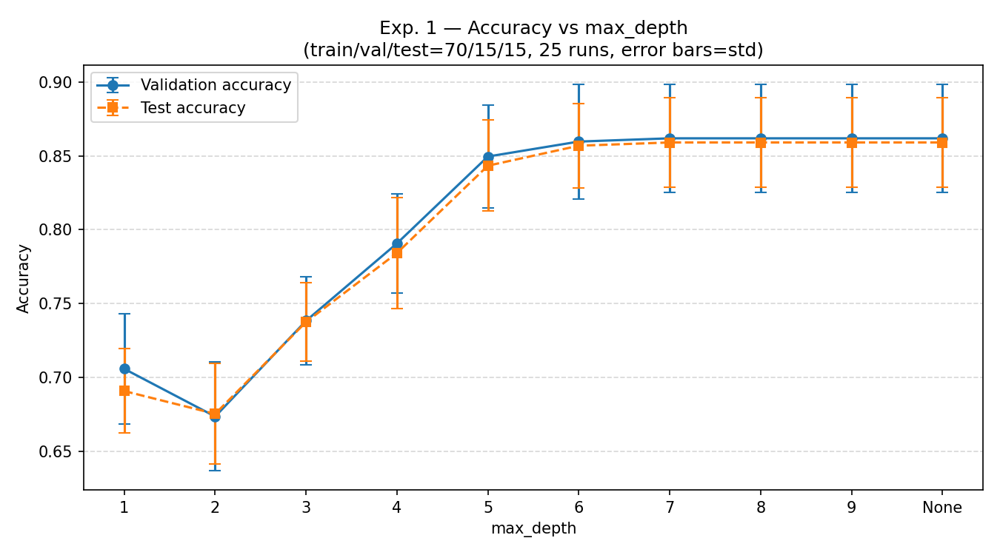
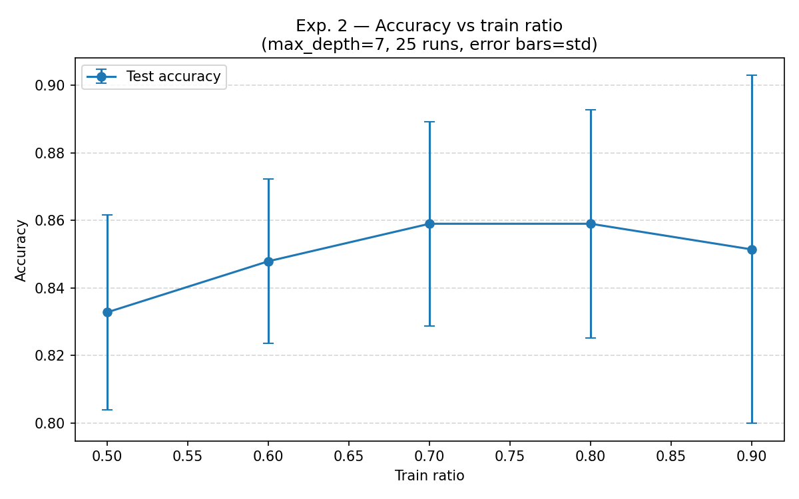
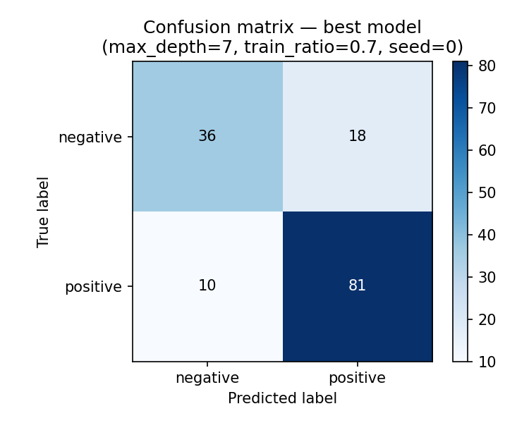

# Wprowadzenie do sztucznej inteligencji

**Ćwiczenie 4 - Regresja i klasyfikacja**
**Typ dokumentu:** Raport z badań
**Semestr:** letni 2025/2026
**Rok akademicki:** 2025/2026
**Autor:** Wiktor Sosnowski
**Numer albumu:** 348 561
**Data:** 15.06.2026

---

## Treść zadania

Cel zadania polega na implementacji drzewa decyzyjnego tworzonego algorytmem ID3 z ograniczeniem maksymalnej głębokości drzewa, jak również na stworzeniu i zbadaniu jakości klasyfikatora dla zbioru danych Tic-Tac-Toe Endgame.

Kroki do wykonania:

1. Zaimplementuj drzewo decyzyjne ID3 (z ograniczeniem jego maksymalnej głębokości).
2. Zbadaj skuteczność działania klasyfikatora dla zbioru danych Tic-Tac-Toe Endgame, obliczając dokładność i macierz pomyłek.

---

## Interpretacja zadania

Celem zadania jest implementacja algorytmu ID3 (Iterative Dichotomiser 3) służącego do budowy drzewa decyzyjnego dla problemów klasyfikacji. Algorytm wybiera w każdym węźle atrybut o najwyższym przyroście informacji (information gain), definiowanym jako różnica entropii Shannona zbioru przed i po podziale. Parametr maksymalnej głębokości drzewa ogranicza liczbę kolejnych podziałów, co pozwala kontrolować złożoność modelu i zapobiegać przeuczeniu.

Zbiór danych Tic-Tac-Toe Endgame zawiera przykładowe końcowe stany planszy kółko-krzyżyk opisane wyłącznie atrybutami kategorycznymi, co czyni go odpowiednim do zastosowania algorytmu ID3.

---

## Zbiór danych

Zbiór danych Tic-Tac-Toe Endgame pochodzi z repozytorium UCI Machine Learning Repository. Zawiera 958 przykładów opisujących wszystkie możliwe końcowe stany planszy 3x3 w grze kółko-krzyżyk, w których gracz `x` wykonuje ruch jako pierwszy.

Każdy przykład składa się z 9 atrybutów kategorycznych odpowiadających polom planszy (wartości: `x`, `o`, `b` - puste pole) oraz etykiety klasy:

- `positive` - gracz `x` wygrał (626 przykładów)
- `negative` - gracz `x` nie wygrał (332 przykłady)

Zbiór jest niezrównoważony - klasa `positive` stanowi około 65% przykładów.

---

## Opis implementacji

Implementacja znajduje się w pliku `src/assignment_04/id3.py` i składa się z następujących elementów:

**Funkcje pomocnicze:**
- `entropy(labels)` - oblicza entropię Shannona tablicy etykiet
- `information_gain(labels, subsets)` - oblicza przyrost informacji dla danego podziału
- `accuracy(y_true, y_pred)` - oblicza dokładność klasyfikacji
- `confusion_matrix(y_true, y_pred)` - buduje macierz pomyłek

**Klasa `Node`** reprezentuje pojedynczy węzeł drzewa. Węzeł wewnętrzny przechowuje indeks atrybutu i słownik dzieci (wartość atrybutu -> węzeł), a liść przechowuje etykietę klasy.

**Klasa `DecisionTreeID3`** implementuje algorytm ID3:
- `fit(X, y)` - buduje drzewo rekurencyjnie metodą `_build`, wybierając w każdym węźle atrybut o najwyższym przyroście informacji; rekurencja kończy się, gdy wszystkie przykłady należą do jednej klasy, brak dostępnych atrybutów lub osiągnięto limit głębokości - w ostatnich dwóch przypadkach tworzony jest liść z etykietą wynikającą z głosu większości
- `predict(X)` - klasyfikuje przykład, przechodząc od korzenia do liścia według wartości atrybutów; dla wartości niewidzianych w treningu zwraca etykietę najczęściej występującą w poddrzewie

Implementacja jest uniwersalna - nie zawiera żadnych zależności od konkretnego zbioru danych.

---

## Eksperymenty

Algorytm ID3 jest z natury deterministyczny - przy ustalonych danych treningowych buduje zawsze to samo drzewo. Źródłem losowości jest podział danych na zbiory treningowy, walidacyjny i testowy. Dlatego każda konfiguracja parametrów została przetestowana w 25 losowych podziałach (ziarna 0-24), a wyniki agregowano statystycznie.

### Eksperyment 1 - wpływ maksymalnej głębokości drzewa

**Stałe parametry:** podział train/val/test = 70/15/15, 25 powtórzeń

**Badany parametr:** max_depth w zbiorze {1, 2, 3, 4, 5, 6, 7, 8, 9, None}

#### Dokładność na zbiorze walidacyjnym

| max_depth | min | średnia | std | max |
|-----------|-----|---------|-----|-----|
| 1 | 0,66 | 0,71 | 0,04 | 0,79 |
| 2 | 0,60 | 0,67 | 0,04 | 0,74 |
| 3 | 0,69 | 0,74 | 0,03 | 0,82 |
| 4 | 0,73 | 0,79 | 0,03 | 0,85 |
| 5 | 0,77 | 0,85 | 0,03 | 0,91 |
| 6 | 0,78 | 0,86 | 0,04 | 0,94 |
| 7 | 0,80 | 0,86 | 0,04 | 0,94 |
| 8 | 0,80 | 0,86 | 0,04 | 0,94 |
| 9 | 0,80 | 0,86 | 0,04 | 0,94 |
| None | 0,80 | 0,86 | 0,04 | 0,94 |

#### Dokładność na zbiorze testowym

| max_depth | min | średnia | std | max |
|-----------|-----|---------|-----|-----|
| 1 | 0,65 | 0,69 | 0,03 | 0,75 |
| 2 | 0,61 | 0,68 | 0,03 | 0,73 |
| 3 | 0,68 | 0,74 | 0,03 | 0,79 |
| 4 | 0,70 | 0,78 | 0,04 | 0,86 |
| 5 | 0,78 | 0,84 | 0,03 | 0,92 |
| 6 | 0,79 | 0,86 | 0,03 | 0,90 |
| 7 | 0,79 | 0,86 | 0,03 | 0,91 |
| 8 | 0,79 | 0,86 | 0,03 | 0,91 |
| 9 | 0,79 | 0,86 | 0,03 | 0,91 |
| None | 0,79 | 0,86 | 0,03 | 0,91 |

Wyniki na zbiorze walidacyjnym i testowym rosną wraz z głębokością do poziomu max_depth = 7, po czym pozostają niezmienione dla wartości 8, 9 i None. Oznacza to, że drzewo budowane na tym zbiorze danych nie przekracza głębokości 7 nawet bez ograniczeń - dalsze zwiększanie parametru nie ma już wpływu. Najniższą dokładność uzyskano dla max_depth = 2, ponieważ przy głębokości 1 drzewo stosuje tylko jeden podział i uzyskuje wyższy wynik niż przy 2, gdzie dodatkowy podział nie kompensuje jeszcze utraty informacji. Wzrost dokładności między max_depth = 4 a 5 jest najwyraźniejszy (około 6 punktów procentowych na zbiorze testowym), co sugeruje, że na tym poziomie głębokości drzewo zaczyna uchwytywać najistotniejsze zależności w danych.

Nie zaobserwowano objawów przeuczenia - dokładność na zbiorze testowym jest zbliżona do walidacyjnej na każdym poziomie głębokości.

**Najlepsza wartość parametru: max_depth = 7** (dalsze zwiększanie nie przynosi poprawy, mniejsze wartości dają gorsze wyniki).

---

### Eksperyment 2 - wpływ proporcji zbioru treningowego

**Stałe parametry:** max_depth = 7, 25 powtórzeń; zbiór walidacyjny i testowy dzielą po równo pozostałą część danych

**Badany parametr:** train_ratio w zbiorze {0,50, 0,60, 0,70, 0,80, 0,90}

#### Dokładność na zbiorze testowym

| train_ratio | min | średnia | std | max |
|-------------|-----|---------|-----|-----|
| 0,50 | 0,76 | 0,83 | 0,03 | 0,88 |
| 0,60 | 0,78 | 0,85 | 0,02 | 0,89 |
| 0,70 | 0,79 | 0,86 | 0,03 | 0,91 |
| 0,80 | 0,78 | 0,86 | 0,03 | 0,91 |
| 0,90 | 0,73 | 0,85 | 0,05 | 0,94 |

Średnia dokładność na zbiorze testowym rośnie od train_ratio = 0,50 do 0,70, po czym utrzymuje się na tym samym poziomie dla 0,80 (0,86 w obu przypadkach). Przy train_ratio = 0,90 średnia nieznacznie spada, a odchylenie standardowe wyraźnie rośnie do 0,05 - wynik staje się niestabilny, co jest efektem małego rozmiaru zbioru testowego (tylko 10% danych, czyli około 96 przykładów). Wartość train_ratio = 0,70 osiąga tę samą średnią dokładność co 0,80, lecz przy większym zbiorze testowym (15% zamiast 10%), co daje bardziej wiarygodną ocenę jakości modelu.

**Najlepsza wartość parametru: train_ratio = 0,70** - zapewnia dobry kompromis między rozmiarem zbioru treningowego a wiarygodnością oceny na zbiorze testowym.

---

## Macierz pomyłek - najlepszy model

**Parametry:** max_depth = 7, train_ratio = 0,70 (val/test = 0,15/0,15), seed = 0

**Dokładność na zbiorze testowym:** 0,81

|  | Przewidziano: negative | Przewidziano: positive |
|--|------------------------|------------------------|
| **Rzeczywiste: negative** | 36 | 18 |
| **Rzeczywiste: positive** | 10 | 81 |

Model poprawnie sklasyfikował 117 z 145 przykładów w zbiorze testowym. Liczba fałszywie ujemnych (FN = 18, klasa positive sklasyfikowana jako negative) jest wyższa niż liczba fałszywie dodatnich (FP = 10, klasa negative sklasyfikowana jako positive). Wynika to ze struktury zbioru - klasa positive jest liczniejsza, dlatego model lepiej uczy się jej wzorców. Dokładność w tym konkretnym podziale (0,81) jest nieznacznie niższa od średniej z 25 powtórzeń (0,86), co mieści się w typowej zmienności wyników.

---

## Wnioski końcowe

| Parametr | Badany zakres | Najlepsza wartość |
|----------|---------------|-------------------|
| max_depth | 1, 2, 3, 4, 5, 6, 7, 8, 9, None | 7 |
| train_ratio | 0,50 - 0,90 | 0,70 |

Zaimplementowany algorytm ID3 osiąga średnią dokładność około 0,86 na zbiorze testowym przy optymalnych parametrach. Najważniejszym parametrem okazała się maksymalna głębokość drzewa - zbyt mała (1-4) wyraźnie obniża jakość klasyfikacji, natomiast powyżej 7 nie przynosi dalszej poprawy, ponieważ drzewo budowane na tym zbiorze nie przekracza tej głębokości. Nie zaobserwowano objawów przeuczenia - wyniki na zbiorach walidacyjnym i testowym są zbliżone na wszystkich poziomach głębokości.

Proporcja podziału danych ma mniejszy wpływ na średnią dokładność niż głębokość drzewa - różnica między najgorszym (0,50) a najlepszym (0,70) wynikiem wynosi około 3 punkty procentowe. Zbyt duży zbiór treningowy (0,90) skutkuje wzrostem niestabilności wyników z powodu małego rozmiaru zbioru testowego.
