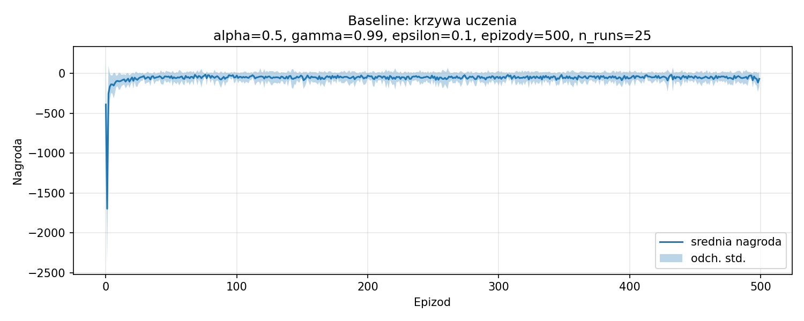
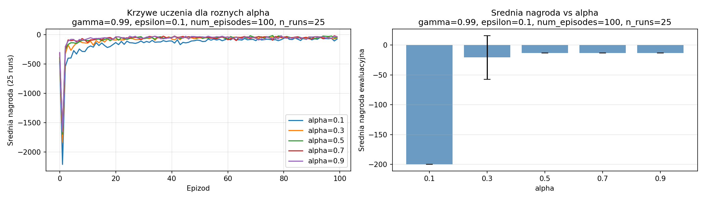
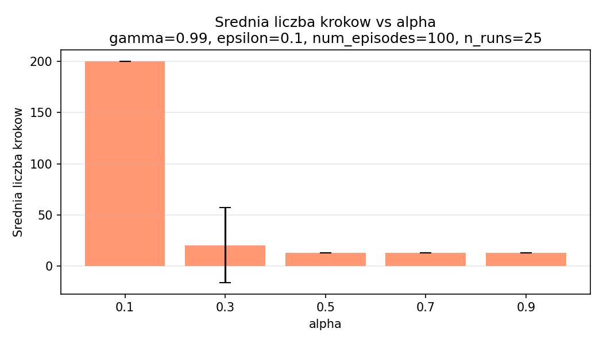
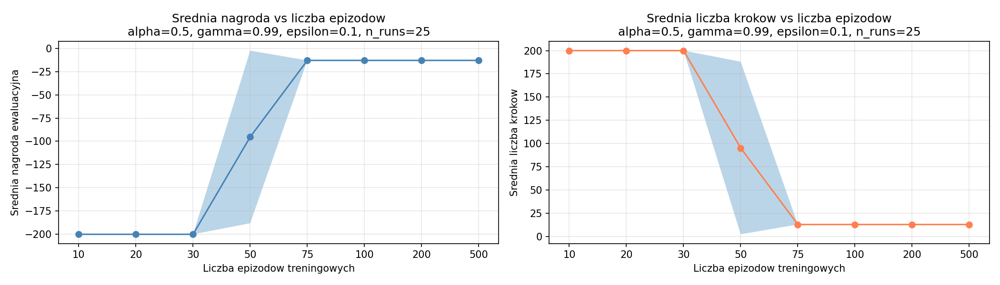

# Wprowadzenie do sztucznej inteligencji

**Numer ćwiczenia:** 06  
**Temat:** Uczenie się ze wzmocnieniem - Q-Learning  
**Typ dokumentu:** Raport z badań  
**Semestr:** letni 2025/2026  
**Autor:** Wiktor Sosnowski  
**Numer albumu:** 348 561  
**Data:** 15.06.2026

---

## Treść zadania

Cel zadania polega na implementacji algorytmu Q-learning oraz zastosowaniu go do rozwiązania problemu Cliff Walking. Środowisko to jest dostępne w pakiecie gymnasium (`gym.make('CliffWalking-v0')`).

Kroki do wykonania:

1. Implementacja algorytmu Q-learning.
2. Zbadanie skuteczności działania algorytmu dla problemu Cliff Walking dla różnych wartości współczynnika uczenia i różnej liczby epizodów (w procesie trenowania).

Uwagi: Implementacja algorytmu powinna być uniwersalna, tzn. możliwa do wykorzystania dla różnych środowisk o dyskretnej przestrzeni stanów i akcji.

---

## Interpretacja zadania

Q-learning jest algorytmem uczenia się ze wzmocnieniem (ang. reinforcement learning). Agent działa w środowisku, które po każdej akcji zwraca nagrodę i nowy stan. Celem agenta jest maksymalizacja sumarycznej nagrody w epizodzie.

Algorytm utrzymuje tablicę Q o wymiarach liczba_stanów x liczba_akcji. Każdy wpis Q(s, a) przybliża oczekiwaną sumaryczną nagrodę, jaką agent uzyska, będąc w stanie s i wykonując akcję a, a następnie postępując optymalnie. Aktualizacja po każdym kroku odbywa się według wzoru:

```
Q(s, a) <- Q(s, a) + alpha * (r + gamma * max_a' Q(s', a') - Q(s, a))
```

gdzie alpha to współczynnik uczenia, gamma to współczynnik dyskontowania nagród przyszłych, r to otrzymana nagroda, a s' to następny stan.

Do wyboru akcji stosowana jest strategia epsilon-zachłanna: z prawdopodobieństwem epsilon agent wybiera losową akcję (eksploracja), a z prawdopodobieństwem 1-epsilon wybiera akcję o najwyższej wartości Q (eksploatacja).

Środowisko Cliff Walking to siatka 4x12. Agent startuje w lewym dolnym rogu i musi dotrzeć do prawego dolnego rogu. Dolny rząd (oprócz startu i celu) to klif - wejście na niego kończy epizod z karą -100. Każdy krok kosztuje -1. Optymalna ścieżka prowadzi wzdłuż klifu i ma długość 12 kroków (nagroda -12), jednak agent uczący się ze wzmocnieniem - ze względu na ryzyko wpadnięcia na klif podczas eksploracji - typowo uczy się bezpieczniejszej ścieżki górnym skrajem siatki o długości 13 kroków (nagroda -13).

Skuteczność po treningu oceniana jest w jednym epizodzie greedy (epsilon=0): mierzona jest suma nagród (reward) i liczba kroków (steps).

---

## Opis implementacji

Zaimplementowano klasę `QLearningAgent` z metodą `update` realizującą krok TD (ang. temporal difference) zgodnie z powyższym wzorem. Tablica Q inicjalizowana jest zerami. Wybór akcji realizuje metoda `select_action` z parametrem `greedy` - przy `greedy=True` agent zawsze wybiera akcję o najwyższej wartości Q (ewaluacja po treningu).

Funkcja `train` przeprowadza trening przez zadaną liczbę epizodów. Funkcja `evaluate` uruchamia jeden epizod greedy z limitem 200 kroków - limit ten zapobiega nieskończonej pętli dla nienauczonego agenta (nienauczony agent krąży w miejscu, ponieważ wszystkie wartości Q są równe zeru i argmax zawsze zwraca akcję o indeksie 0).

Funkcja `run_experiment` powtarza pełny cykl trening+ewaluacja 25 razy z niezależną tablicą Q i innym ziarnem generatora liczb pseudolosowych w każdym uruchomieniu.

Implementacja jest uniwersalna - przyjmuje jako parametry liczbę stanów i akcji, więc może być użyta dla dowolnego środowiska o dyskretnej przestrzeni stanów i akcji.

---

## Środowisko

Użyto środowiska `CliffWalking-v1` z pakietu gymnasium z domyślnym parametrem `is_slippery=False`, co jest równoważne z opisanym w treści zadania `CliffWalking-v0` (wersja v0 została wycofana w aktualnej wersji biblioteki). Środowisko ma 48 stanów (siatka 4x12) i 4 akcje (góra, prawo, dół, lewo).

---

## Konfiguracja bazowa (Baseline)

**Parametry:** alpha=0,5, gamma=0,99, epsilon=0,1, num_episodes=500, n_runs=25

| metryka | min | średnia | std | max |
|---------|-----|---------|-----|-----|
| nagroda | -13,00 | -13,00 | 0,00 | -13,00 |
| liczba kroków | 13,00 | 13,00 | 0,00 | 13,00 |

Przy konfiguracji bazowej we wszystkich 25 uruchomieniach agent osiąga wynik -13 (13 kroków) - min, średnia, max i std są identyczne. Jest to oczekiwany wynik dla Q-learning w tym środowisku - agent uczy się bezpiecznej ścieżki górnym skrajem siatki, unikając klifu.



Krzywa uczenia pokazuje szybkie osiągnięcie stabilnego wyniku około -13. Wahania we wczesnych epizodach wynikają z eksploracji - agent wpada na klif, co generuje duże kary. Po około 50-100 epizodach algorytm stabilizuje się na optymalnej ścieżce.

---

## Eksperyment 1 - wpływ współczynnika uczenia (alpha)

**Stałe parametry:** gamma=0,99, epsilon=0,1, num_episodes=100  
**Badany zakres:** alpha w {0,1; 0,3; 0,5; 0,7; 0,9}

Liczba epizodów ustawiona na 100, ponieważ przy tej wartości różnice między wartościami alpha są wyraźnie widoczne - więcej epizodów prowadzi do zbieżności wszystkich wariantów.

### Tabela 1a - nagroda ewaluacyjna vs alpha

| alpha | min | średnia | std | max |
|-------|-----|---------|-----|-----|
| 0,1 | -200,00 | -200,00 | 0,00 | -200,00 |
| 0,3 | -200,00 | -20,56 | 36,63 | -13,00 |
| 0,5 | -13,00 | -13,00 | 0,00 | -13,00 |
| 0,7 | -13,00 | -13,00 | 0,00 | -13,00 |
| 0,9 | -13,00 | -13,00 | 0,00 | -13,00 |

### Tabela 1b - liczba kroków ewaluacyjnych vs alpha

| alpha | min | średnia | std | max |
|-------|-----|---------|-----|-----|
| 0,1 | 200,00 | 200,00 | 0,00 | 200,00 |
| 0,3 | 13,00 | 20,56 | 36,63 | 200,00 |
| 0,5 | 13,00 | 13,00 | 0,00 | 13,00 |
| 0,7 | 13,00 | 13,00 | 0,00 | 13,00 |
| 0,9 | 13,00 | 13,00 | 0,00 | 13,00 |





Przy alpha=0,1 agent w żadnym z 25 uruchomień nie zdołał nauczyć się właściwej polityki w ciągu 100 epizodów - wynik -200 odpowiada limitowi 200 kroków, co oznacza brak zbieżności. Mały współczynnik uczenia powoduje, że wartości Q aktualizowane są bardzo wolno i 100 epizodów to za mało, by zgromadzić wystarczającą wiedzę.

Przy alpha=0,3 wyniki są niejednorodne: średnia -20,56 ze standardowym odchyleniem 36,63 wskazuje, że część uruchomień zbiega do optimum (-13), a część nie - co potwierdza max=-13 i min=-200. Współczynnik jest już wystarczający do zbieżności, ale nie we wszystkich uruchomieniach.

Od alpha=0,5 wzwyż we wszystkich 25 uruchomieniach wynik ewaluacyjny wynosi -13, a std=0 - brak jakiejkolwiek zmienności między uruchomieniami. Większe wartości alpha przyspieszają uczenie, przez co 100 epizodów jest wystarczające.

**Wniosek:** Zbyt mały współczynnik uczenia (alpha=0,1) uniemożliwia zbieżność przy 100 epizodach - żadne z 25 uruchomień nie osiąga celu (std=0, mean=-200). Wartości alpha od 0,5 wzwyż dają wynik -13 we wszystkich 25 uruchomieniach (std=0). W tym środowisku optymalny zakres to alpha >= 0,5 przy 100 epizodach treningowych.

---

## Eksperyment 2 - wpływ liczby epizodów treningowych

**Stałe parametry:** alpha=0,5, gamma=0,99, epsilon=0,1  
**Badany zakres:** num_episodes w {10; 20; 30; 50; 75; 100; 200; 500}

### Tabela 2a - nagroda ewaluacyjna vs liczba epizodów

| liczba epizodów | min | średnia | std | max |
|----------------|-----|---------|-----|-----|
| 10 | -200,00 | -200,00 | 0,00 | -200,00 |
| 20 | -200,00 | -200,00 | 0,00 | -200,00 |
| 30 | -200,00 | -200,00 | 0,00 | -200,00 |
| 50 | -200,00 | -95,28 | 92,82 | -13,00 |
| 75 | -13,00 | -13,00 | 0,00 | -13,00 |
| 100 | -13,00 | -13,00 | 0,00 | -13,00 |
| 200 | -13,00 | -13,00 | 0,00 | -13,00 |
| 500 | -13,00 | -13,00 | 0,00 | -13,00 |

### Tabela 2b - liczba kroków ewaluacyjnych vs liczba epizodów

| liczba epizodów | min | średnia | std | max |
|----------------|-----|---------|-----|-----|
| 10 | 200,00 | 200,00 | 0,00 | 200,00 |
| 20 | 200,00 | 200,00 | 0,00 | 200,00 |
| 30 | 200,00 | 200,00 | 0,00 | 200,00 |
| 50 | 13,00 | 95,28 | 92,82 | 200,00 |
| 75 | 13,00 | 13,00 | 0,00 | 13,00 |
| 100 | 13,00 | 13,00 | 0,00 | 13,00 |
| 200 | 13,00 | 13,00 | 0,00 | 13,00 |
| 500 | 13,00 | 13,00 | 0,00 | 13,00 |



Przy 10-30 epizodach agent nie zbiega w żadnym z 25 uruchomień - tablica Q nie zostaje wystarczająco wypełniona, by polityka greedy prowadziła do celu. Wynik -200 oznacza osiągnięcie limitu kroków.

Przy 50 epizodach widoczna jest niejednorodność wyników: średnia -95,28 ze standardowym odchyleniem 92,82 wskazuje, że część uruchomień osiąga optimum, a część nie. Jest to punkt przejścia, w którym zbieżność jest możliwa, ale nie we wszystkich uruchomieniach.

Od 75 epizodów agent zbiega do optymalnego wyniku -13 we wszystkich 25 uruchomieniach. Zwiększanie liczby epizodów powyżej 75 nie poprawia już wyniku ewaluacyjnego - algorytm osiąga optimum, którego nie można przekroczyć bez zmiany epsilon lub gamma.

**Wniosek:** Przy alpha=0,5 już 75 epizodów treningowych wystarczy, by we wszystkich 25 uruchomieniach uzyskać wynik -13 (std=0). Dalsze zwiększanie liczby epizodów nie przynosi poprawy wyniku ewaluacyjnego.

---

## Wnioski końcowe

| parametr | badany zakres | najlepsze wartości |
|----------|--------------|-------------------|
| alpha | 0,1 - 0,9 | >= 0,5 (przy 100 epizodach) |
| num_episodes | 10 - 500 | >= 75 (przy alpha=0,5) |

Q-learning skutecznie rozwiązuje problem Cliff Walking. Algorytm uczy się bezpiecznej polityki górnym skrajem siatki (nagroda -13, 13 kroków), a nie optymalnej w sensie teorii (-12, 12 kroków wzdłuż klifu). Jest to typowe zachowanie Q-learning: podczas eksploracji agent wpada na klif, co penalizuje ścieżkę krawędzią na tyle, że preferowana staje się dłuższa, ale bezpieczniejsza trasa.

Współczynnik uczenia alpha ma istotny wpływ na szybkość zbieżności. Przy alpha=0,1 żadne z 25 uruchomień nie osiąga celu w ciągu 100 epizodów. Przy alpha=0,5 i wyżej wszystkie 25 uruchomień daje identyczny wynik -13 (std=0).

Liczba epizodów treningowych wyznacza, czy agent zdąży zebrać wystarczającą liczbę obserwacji. Przy alpha=0,5 i 10-30 epizodach żadne z 25 uruchomień nie osiąga celu. Przy 75 epizodach wszystkie 25 uruchomień daje wynik -13 (std=0) i dalsze zwiększanie liczby epizodów nie zmienia tego wyniku.

Oba parametry wpływają na zbieżność w podobny sposób: niewystarczające wartości uniemożliwiają naukę, a po przekroczeniu progu wynik stabilizuje się na optimum i nie można go dalej poprawić przez samo zwiększanie alpha lub liczby epizodów.
