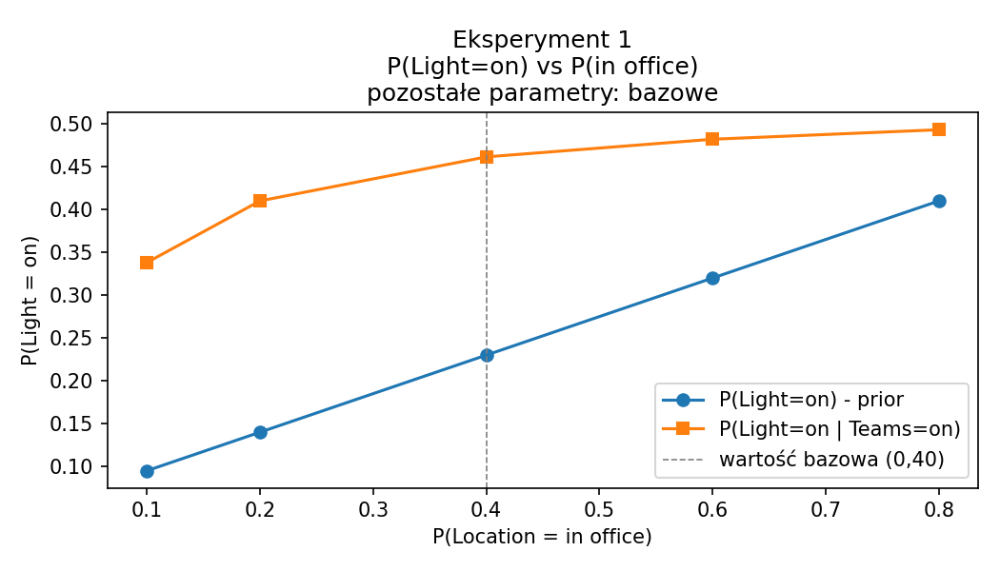
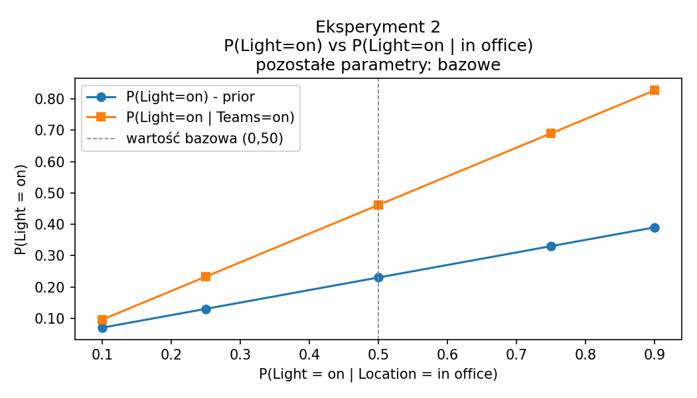
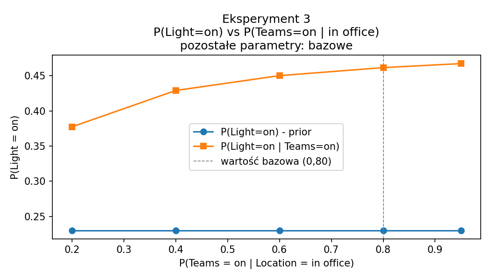
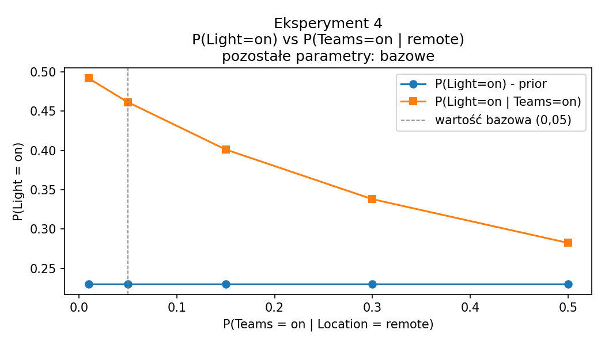

# Wprowadzenie do sztucznej inteligencji

Ćwiczenie 7 - Modele bayesowskie

Raport z badań

Semestr letni 2025/2026

Autor: Wiktor Sosnowski

Numer albumu: 348 561

Data: 15.06.2026

---

## Treść zadania

Cel zadania polega na skonstruowaniu sieci Bayesowskiej oraz zbadaniu wpływu informacji o statusie w MS Teams na prawdopodobieństwo świecenia się światła w pokoju doktorantki K.

Scenariusz: Doktorantka K. spędza 40% czasu pracy w swoim pokoju na uczelni. Pozostałe 60% czasu pracuje zdalnie. Kiedy K. jest w swoim pokoju, połowę czasu ma wyłączone światło (kiedy próbuje ukryć się przed studentami i pracować nad doktoratem). Gdy nie ma jej w pokoju, zostawia włączone światło tylko w 5% przypadków. W 80% czasu, gdy jest w swoim biurze, K. jest zalogowana w MS Teams. Ponieważ czasami loguje się do Teamsów z domu, w 5% przypadków, gdy nie ma jej na uczelni, nadal jest zalogowana w MS Teams.

Kroki do wykonania:

1. Skonstruuj sieć Bayesowską, aby przedstawić opisany scenariusz.
2. Zakładając, że student sprawdza status K. w MS Teams i widzi, że jest ona zalogowana - jaki wpływ ma to na przekonanie studenta, że światło w pokoju K. jest włączone?

---

## Interpretacja zadania

Sieć Bayesowska to probabilistyczny model graficzny, w którym węzły reprezentują zmienne losowe, a krawędzie skierowane oznaczają zależności przyczynowe między nimi. Każdy węzeł posiada tablicę warunkowego rozkładu prawdopodobieństwa (CPD - Conditional Probability Distribution), która opisuje prawdopodobieństwo przyjęcia danej wartości w zależności od wartości węzłów rodzicielskich.

W tym zadaniu modelujemy zależność między lokalizacją doktorantki K. (w biurze lub zdalnie) a dwoma obserwowalnymi zjawiskami: stanem oświetlenia jej pokoju oraz jej statusem w komunikatorze MS Teams. Lokalizacja jest zmienną ukrytą (nie jest bezpośrednio obserwowalna), podczas gdy stan światła i status w Teams mogą być sprawdzone przez studenta.

Wnioskowanie bayesowskie pozwala na aktualizację przekonań o zmiennej ukrytej (Lokalizacja) na podstawie obserwacji (Teams = zalogowana), a następnie wyznaczenie zaktualizowanego prawdopodobieństwa dla innej zmiennej (Światło = włączone).

---

## Opis implementacji

Sieć zbudowano przy użyciu biblioteki `pgmpy` (klasa `DiscreteBayesianNetwork`). Model zawiera trzy dyskretne zmienne dwustanowe:

- Location: 0 = w biurze, 1 = zdalnie
- Light: 0 = włączone, 1 = wyłączone
- Teams: 0 = zalogowana, 1 = wylogowana

Struktura sieci: Location -> Light, Location -> Teams.

Zmienne Light i Teams są warunkowo niezależne przy znajomości Location - Teams nie jest bezpośrednim dowodem na stan światła, lecz dostarcza informacji o lokalizacji, która z kolei wpływa na oświetlenie.

Tablice CPD wyznaczono bezpośrednio z treści zadania. Do wnioskowania użyto algorytmu eliminacji zmiennych (Variable Elimination).

---

## Konfiguracja bazowa

Parametry wynikające z treści zadania:

| Parametr | Wartość |
|---|---|
| P(Lokalizacja = w biurze) | 0,40 |
| P(Światło = włączone / w biurze) | 0,50 |
| P(Światło = włączone / zdalnie) | 0,05 |
| P(Teams = zalogowana / w biurze) | 0,80 |
| P(Teams = zalogowana / zdalnie) | 0,05 |

Wyniki zapytania dla konfiguracji bazowej:

| Zapytanie | Wartość |
|---|---|
| P(Światło = włączone) | 0,23 |
| P(Światło = włączone / Teams = zalogowana) | 0,46 |

Bez żadnej obserwacji prawdopodobieństwo, że światło jest włączone, wynosi 0,23. Po zaobserwowaniu, że doktorantka K. jest zalogowana w MS Teams, prawdopodobieństwo to wzrasta do 0,46 - niemal dwukrotnie. Wynika to z faktu, że status zalogowania w Teams jest silnym wskaźnikiem obecności K. w biurze, a obecność w biurze wiąże się z P(Światło = włączone) = 0,50.

---

## Eksperymenty

### Eksperyment 1 - wpływ P(Lokalizacja = w biurze)

Stałe parametry: P(Światło=wł. / w biurze) = 0,50, P(Światło=wł. / zdalnie) = 0,05, P(Teams=zalog. / w biurze) = 0,80, P(Teams=zalog. / zdalnie) = 0,05.

Badany zakres: P(w biurze) w {0,10; 0,20; 0,40; 0,60; 0,80}.

| P(w biurze) | P(Światło=wł.) | P(Światło=wł. / Teams=zalog.) | Różnica |
|---|---|---|---|
| 0,10 | 0,10 | 0,34 | 0,24 |
| 0,20 | 0,14 | 0,41 | 0,27 |
| 0,40 | 0,23 | 0,46 | 0,23 |
| 0,60 | 0,32 | 0,48 | 0,16 |
| 0,80 | 0,41 | 0,49 | 0,08 |

Oba prawdopodobieństwa rosną wraz ze wzrostem P(w biurze), co jest zgodne z intuicją - im częściej K. bywa w biurze, tym większe a priori prawdopodobieństwo, że światło jest włączone. Wartość P(Światło=wł. / Teams=zalog.) szybciej osiąga nasycenie i dla P(w biurze) = 0,80 wynosi 0,49, podczas gdy prior wynosi już 0,41 - różnica spada do 0,08.

Wnioski: Im rzadziej K. bywa w biurze (małe P(w biurze)), tym większy przyrost informacyjny daje obserwacja statusu Teams. Gdy K. prawie zawsze jest w biurze, informacja o Teams niewiele zmienia, ponieważ i tak spodziewamy się wysokiego prawdopodobieństwa włączonego światła.

---

### Eksperyment 2 - wpływ P(Światło = włączone / w biurze)

Stałe parametry: P(w biurze) = 0,40, P(Światło=wł. / zdalnie) = 0,05, P(Teams=zalog. / w biurze) = 0,80, P(Teams=zalog. / zdalnie) = 0,05.

Badany zakres: P(Światło=wł. / w biurze) w {0,10; 0,25; 0,50; 0,75; 0,90}.

| P(Światło=wł. / w biurze) | P(Światło=wł.) | P(Światło=wł. / Teams=zalog.) | Różnica |
|---|---|---|---|
| 0,10 | 0,07 | 0,10 | 0,03 |
| 0,25 | 0,13 | 0,23 | 0,10 |
| 0,50 | 0,23 | 0,46 | 0,23 |
| 0,75 | 0,33 | 0,69 | 0,36 |
| 0,90 | 0,39 | 0,83 | 0,44 |

Wraz ze wzrostem P(Światło=wł. / w biurze) rośnie zarówno prior, jak i prawdopodobieństwo warunkowe. Różnica między nimi także rośnie - dla wartości 0,90 wynosi aż 0,44. Obserwacja Teams jest tym bardziej wartościowa, im częściej K. zostawia światło włączone będąc w biurze.

Wnioski: Parametr ten bezpośrednio kontroluje, jak mocno obecność K. w biurze przekłada się na stan światła. Gdy P(Światło=wł. / w biurze) jest małe, informacja o Teams nie pomaga - nawet jeśli wiemy, że K. jest w biurze, światło i tak rzadko bywa włączone.

---

### Eksperyment 3 - wpływ P(Teams = zalogowana / w biurze)

Stałe parametry: P(w biurze) = 0,40, P(Światło=wł. / w biurze) = 0,50, P(Światło=wł. / zdalnie) = 0,05, P(Teams=zalog. / zdalnie) = 0,05.

Badany zakres: P(Teams=zalog. / w biurze) w {0,20; 0,40; 0,60; 0,80; 0,95}.

| P(Teams=zalog. / w biurze) | P(Światło=wł.) | P(Światło=wł. / Teams=zalog.) | Różnica |
|---|---|---|---|
| 0,20 | 0,23 | 0,38 | 0,15 |
| 0,40 | 0,23 | 0,43 | 0,20 |
| 0,60 | 0,23 | 0,45 | 0,22 |
| 0,80 | 0,23 | 0,46 | 0,23 |
| 0,95 | 0,23 | 0,47 | 0,24 |

Prior P(Światło=wł.) pozostaje stały dla wszystkich wartości parametru - co jest poprawne, ponieważ zmiana wiarygodności Teams nie wpływa na brzegowe prawdopodobieństwo światła. Wzrost P(Teams=zalog. / w biurze) powoduje wzrost P(Światło=wł. / Teams=zalog.), jednak efekt jest stosunkowo niewielki - między wartością 0,20 a 0,95 różnica wynosi tylko 0,09.

Wnioski: Wiarygodność Teams jako wskaźnika obecności w biurze ma umiarkowany wpływ na wynik wnioskowania. Nawet przy niskiej wiarygodności (0,20) informacja o logowaniu nadal podnosi prawdopodobieństwo włączonego światła. Efekt nasycenia jest widoczny już powyżej wartości 0,60.

---

### Eksperyment 4 - wpływ P(Teams = zalogowana / zdalnie)

Stałe parametry: P(w biurze) = 0,40, P(Światło=wł. / w biurze) = 0,50, P(Światło=wł. / zdalnie) = 0,05, P(Teams=zalog. / w biurze) = 0,80.

Badany zakres: P(Teams=zalog. / zdalnie) w {0,01; 0,05; 0,15; 0,30; 0,50}.

| P(Teams=zalog. / zdalnie) | P(Światło=wł.) | P(Światło=wł. / Teams=zalog.) | Różnica |
|---|---|---|---|
| 0,01 | 0,23 | 0,49 | 0,26 |
| 0,05 | 0,23 | 0,46 | 0,23 |
| 0,15 | 0,23 | 0,40 | 0,17 |
| 0,30 | 0,23 | 0,34 | 0,11 |
| 0,50 | 0,23 | 0,28 | 0,05 |

Prior pozostaje stały, natomiast P(Światło=wł. / Teams=zalog.) wyraźnie maleje wraz ze wzrostem P(Teams=zalog. / zdalnie). Przy wartości 0,50 informacja o zalogowaniu w Teams jest prawie bezużyteczna - prawdopodobieństwo wzrasta jedynie o 0,05 w stosunku do prioru.

Wnioski: Jest to parametr o największym wpływie na użyteczność obserwacji Teams. Im częściej K. loguje się do Teams z domu, tym słabszym dowodem na jej obecność w biurze jest status zalogowania. W skrajnym przypadku (P = 0,50), gdy K. loguje się zdalnie równie często co z biura, obserwacja Teams niemal nie zmienia przekonania o stanie światła.

---

## Wnioski końcowe

| Parametr | Zakres badań | Wpływ na P(Światło=wł. / Teams=zalog.) |
|---|---|---|
| P(w biurze) | 0,10 - 0,80 | Rośnie, efekt informacyjny Teams maleje |
| P(Światło=wł. / w biurze) | 0,10 - 0,90 | Silny wzrost liniowy |
| P(Teams=zalog. / w biurze) | 0,20 - 0,95 | Słaby wzrost, szybkie nasycenie |
| P(Teams=zalog. / zdalnie) | 0,01 - 0,50 | Silny spadek - parametr krytyczny |

Konfiguracja bazowa z treści zadania daje P(Światło=wł.) = 0,23 oraz P(Światło=wł. / Teams=zalog.) = 0,46. Zaobserwowanie statusu zalogowania w Teams niemal podwaja prawdopodobieństwo włączonego światła w tym scenariuszu.

Eksperymenty pokazują, że użyteczność informacji o statusie Teams jako dowodu na włączone światło zależy w największym stopniu od dwóch parametrów: P(Światło=wł. / w biurze) oraz P(Teams=zalog. / zdalnie). Pierwszy z nich kontroluje, jak mocno obecność w biurze przekłada się na stan światła - im wyższy, tym bardziej warto wiedzieć, czy K. jest w biurze. Drugi parametr decyduje o diagnostyczności samego Teams jako wskaźnika lokalizacji - gdy K. loguje się zdalnie równie często co z biura, status Teams przestaje być użytecznym dowodem.

Parametr P(Teams=zalog. / w biurze) ma zaskakująco mały wpływ w porównaniu z pozostałymi - efekt nasycenia pojawia się już przy wartości około 0,60, a dalszy wzrost do 0,95 zmienia wynik jedynie o 0,02. Wynika to z tego, że przy stosunkowo niskim P(Teams=zalog. / zdalnie) = 0,05 już średnia wiarygodność Teams z biura wystarcza do uzyskania silnego sygnału.
